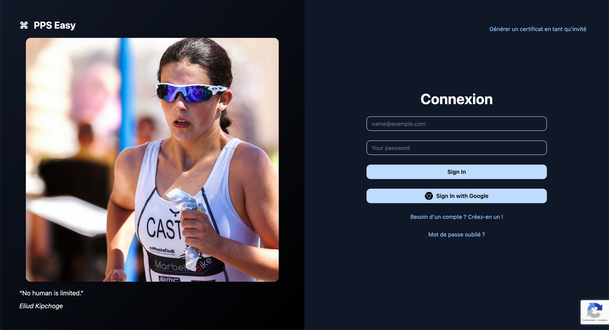

# PPS Easy

[](https://github.com/abarghoud/pps-easy/actions/workflows/ci.yml)

## Overview

This is an open-source project that allows users to quickly complete the PPS (Parcours de Prévention Santé) journey in France by simulating the required steps. It interacts with PPS APIs to optimize the process, enabling faster access to the PPS certification.

## Features

- **Quick PPS Completion**: Simulates the process, allowing users to obtain their PPS certification rapidly (3 seconds).
- **Data safe**: Your data is just transferred to https://pps.athle.fr/, and the result is sent back to your provided email

### Certificate Generation Form


The certificate generation form is accessible after logging in or as a guest. This form allows users to enter the necessary information (date of birth, event date, email, first name, last name, and gender) to generate the PPS certificate 🪄.

### Home Page with Login/Registration



The frontend application provides a home page with the following options:
- **Sign In with Username and Password**
- **Sign In with Google**
- **Access as Guest** to generate a certificate without creating an account.

**Planned Features:** In future updates, users will be able to **save their data** to avoid re-entering it each time they use PPS Easy. Additionally, an option will be added to **automatically generate the certificate every three** months, ensuring users always have an up-to-date certification without manual input.

## Installation

1. Clone the repository:

   ```bash
   git clone https://github.com/abarghoud/pps-easy.git
   cd pps-easy
   ```

2. Install dependencies:

   ```bash
   yarn install
   ```

3. Set up the environment:

   - Create a `.env` file at client and api projects root and set `ENVIRONMENT=local` to mock third-party services in local mode.

4. Run the backend:

   ```bash
   yarn nx serve api
   ```

5. Run the frontend:

   ```bash
   yarn nx serve client
   ```

## Usage

### API

You can use the following `curl` command to simulate the PPS journey:

```bash
curl --location 'http://localhost:3000/api/pps/generate' \
--header 'Content-Type: application/json' \
--data-raw '{
    "birthday": "1990-01-01",
    "event_date": "2024-12-25",
    "email": "example@example.com",
    "firstname": "John",
    "gender": "male",
    "lastname": "DOE",
    "recaptchaToken": "your-recaptcha-token"
}'
```

Replace the placeholder data with your personal information to simulate your PPS journey.

- If `ENVIRONMENT=local` is set in both the frontend and backend projects, recaptchaToken can be any non-empty string.
- Otherwise, recaptchaToken must be a valid Google reCAPTCHA token.


**_Please note the race date should be within 3 months_**


### User Interface

Access the application by visiting `http://localhost:4200` (or the configured port) to interact with the frontend. You can choose to log in, register, or generate a certificate as a guest.

## Contribution

Contributions are welcome! Feel free to submit a pull request or open an issue.

## License

This project is licensed under the MIT License.
